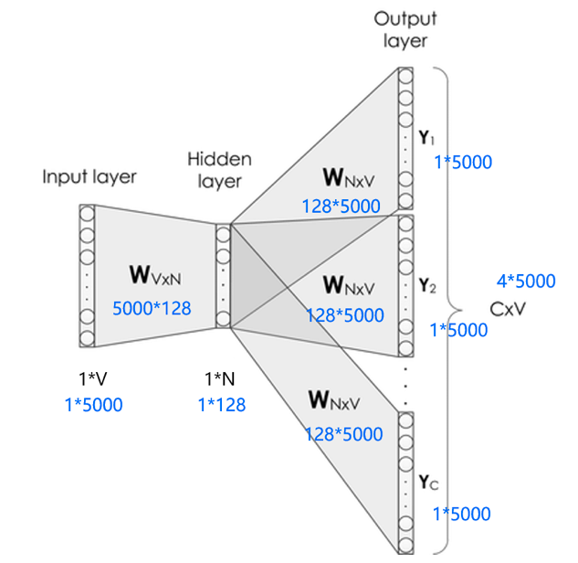

## 简单说一下skip_gram

## Skip-gram的网络结构

Skip-gram的网络结构共包含三层：输入层，隐藏层和输出层。它的处理步骤是这样的：

- 输入层接收shape为[1,V]的one-hot向量*x*，其中*V*代表词表中单词的数量，这个one-hot向量就是上述提到的中心词。

- 隐藏层包含一个shape为[V,N]的参数矩阵*W1*，其中*N*代表词向量的维度，*W1*就是word embedding矩阵，即我们要学习的词向量。将输入的one-hot向量*x*与*W1*相乘，便可得到一个shape为[1,N]的向量，即该输入单词对应的词向量*e*。

- 输出层包含一个shape为[N,V]的参数矩阵*W2*，将隐藏层输出的*e*与*W2*相乘，便可以得到shape为[1,V]的向量*r，内部的数值分别代表每个候选词的打分。使用softmax函数，对这些打分进行归一化，即得到中心词的预测各个单词的概率。

这是一种比较理想的实现方式，但是这里有两个问题：

1. 这个输入向量是个one-hot编码的方式，只有一个元素为1，其他全是0，是个极其稀疏的向量，假设它第2个位置为1，它和word embedding相乘，便可获得word embedding矩阵的第二行的数据。那么我们知道这个规律，直接通过访存的方式直接获取就可以了，不需要进行矩阵相乘。

2. 在获取了输入单词对应的词向量e后，它是一个[1,N] 向量。接下来，会使用这个向量和另外一个大的矩阵W2进行相乘，最终会获得一个1*V的向量，然后对这个向量进行softmax，可以看到这个向量具有词表的长度，对这么长的向量进行softmax本身也是一个极其消耗资源的事情。

## CBOW也是差不多，无非是输入是多个词，输出是一个词
