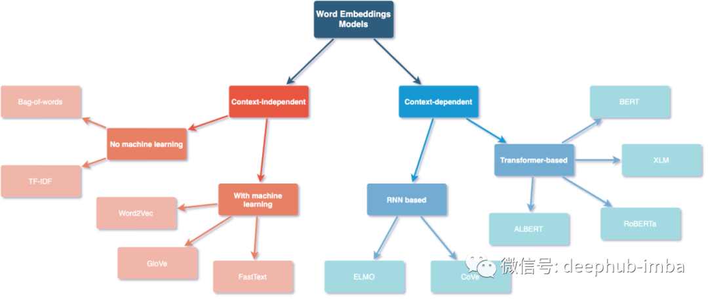

### :smile: 有关embedding，我想学一下词元向量化以及位置编码的嵌入 :laughing:

# 词嵌入方法总结

## 与上下文无关

这类模型学习到的表征特点是，在不考虑单词上下文的情况下，每个单词都是独特的和不同的。

### 不需要学习

- Bag-of-words（词袋）
  * 一个文本（如一个句子或一个文档）被表示为它的词袋，不考虑语法、词序。

- TF-IDF
  * 通过获取词的频率(TF)并乘以词的逆文档频率(IDF)来得到这个分数。

### 需要进行学习

- Word2Vec
  * 经过训练以重建单词的语言上下文的浅层（两层）神经网络。
  * 可以利用两种模型架构中的任何一种：
    - 连续词袋 (CBOW)：模型从周围上下文词的窗口中预测当前词。
    - 连续skip-gram：模型使用当前词来预测上下文的周围窗口。

- GloVe（Global Vectors for Word Representation）
  * 训练是在语料库中汇总的全局单词-单词共现统计数据上执行的。
  * 结果表示显示了单词向量空间的线性子结构。

- FastText
  * 与 GloVe 不同，它通过将每个单词视为由字符 n-gram 组成而不是整个单词来嵌入单词。
  * 此功能使其不仅可以学习生僻词，还可以学习词汇表外的词。

## 上下文相关

与上下文无关的词嵌入不同，上下文相关的方法根据其上下文为同一个词学习不同的嵌入表示。

### 基于 RNN

- ELMO（Embeddings from Language Model）
  * 使用基于字符的编码层和两个 BiLSTM 层的神经语言模型来学习上下文化的词表示。
  * 可以学习情景化的单词表示。

- CoVe（Contextualized Word Vectors）
  * 使用深度 LSTM 编码器，该编码器来自经过机器翻译训练的注意力seq2seq模型。
  * 将单词向量上下文化。

### 基于Transformers

- BERT（Bidirectional Encoder Representations from Transformers）
  * 在大型跨域语料库上训练的基于Transformers的语言表示模型。
  * 使用掩码语言模型来预测序列中随机被遮蔽的单词。
  * 通过下一句预测任务，用于学习句子之间的关联。

- XLM（Cross-lingual Language Model）
  * 一种基于单语言语种的非监督方法来学习跨语种表示的跨语言模型。
  * 通过将不同语言放在一起采用新的训练目标进行训练，从而让模型能够掌握更多的跨语言信息。

- RoBERTa (Robustly Optimized BERT Pretraining Approach)
  * 建立在 BERT 之上并修改了关键超参数。
  * 移除了下一句预训练目标。
  * 以更大的小批量和学习率进行训练。

- ALBERT（A Lite BERT for Self-supervised Learning of Language Representations）
  * 提出了参数减少技术。
  * 降低内存消耗并提高 BERT 的训练速度。