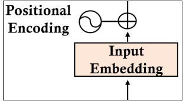
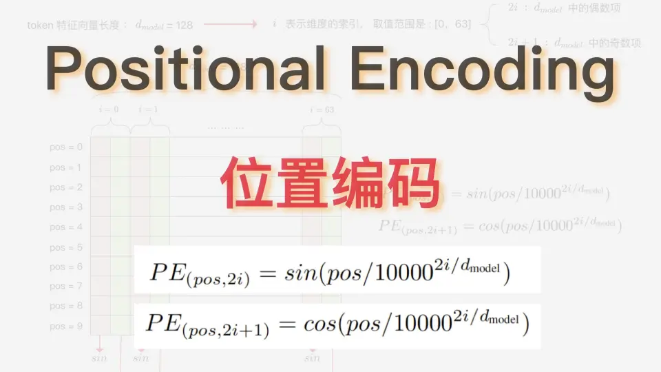
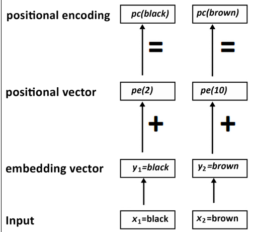

### :smile: 位置编码

#### 一个句子经过分词后,得到多个词元/token，每一个token再向量化，得到语义信息。但是这就足够了吗？显然不够，因为一个句子中词与词之间的位置信息是不同的，比如“我喜欢吃苹果”和“我喜欢吃香蕉”，虽然“我”、“喜欢”、“吃”、“苹果”和“香蕉”这些词元/token都是一样的，但是“苹果”和“香蕉”在句子中的位置是不同的，所以我们需要在向量中添加位置信息，这就是位置编码。


### :smile: 位置编码的算法。



位置编码算法的解释：

1. 位置编码的长度与词向量长度相同，即d_model
2. 位置编码的值由公式计算得到，其中pos表示位置，d_model表示维度
3. 由sin和cos函数计算得到.

### :smile:位置编码的代码实现

```python
import math
import numpy as np

def position_encoding(pos,d_model):
    pe1 = np.zeros((1, d_model))
    for i in range(0,512,2):
        pe1[0][i] = math.sin(pos / (10000 ** ((2 * i)/d_model)))
        
        pe1[0][i+1] = math.cos(pos / (10000 ** ((2 * i)/d_model)))
    return pe1
```
result:
```python
array([[-9.58924275e-01,  2.83662185e-01, -9.98228686e-01,
        -5.94936235e-02, -9.27709288e-01, -3.73303464e-01,
        -7.75570465e-01, -6.31261003e-01, -5.71127201e-01,
        -8.20861572e-01, -3.40604974e-01, -9.40206494e-01,
        -1.05120930e-01, -9.94459446e-01,  1.19822113e-01,
        -9.92795377e-01,  3.23935204e-01, -9.46079269e-01,
         5.01297008e-01, -8.65275280e-01,  6.49369480e-01,
        -7.60473062e-01,  7.68056589e-01, -6.40381977e-01,
         8.58895997e-01, -5.12150043e-01,  9.24414586e-01,
        -3.81389137e-01,  9.67644549e-01, -2.52317314e-01,
         9.91779836e-01, -1.27956074e-01,  9.99946517e-01,......]])
```

### :smile:不同位置的差别

通过公式计算发现，不同位置（pos）的位置编码的值是不同的，pos位置越近，所计算出的余弦相似度越接近1，pos位置越远，所计算出的余弦相似度越接近-1，所以位置编码的值可以用来表示词与词之间的位置关系。

### :smile:将位置编码加入到嵌入向量中



transformer的设计者给出了一个简单的解决方案，就是把嵌入向量与位置编码相加。但是当位置编码很大时，可能会把嵌入向量的淹没，导致丢失嵌入信息。

所以我们需要尽可能增大嵌入向量的值，避免信息丢失。

简单介绍一种方法：

```
y1*math.sqrt(d_model)
```

所以整合成一个方法就是：
```python
import math
import numpy as np

def position_word(paa,pos,d_model):
    pe1 = np.zeros((1, d_model))
    for i in range(0,512,2):
        pe1[0][i] = math.sin(pos / (10000 ** ((2 * i)/d_model)))
        paa[0][i] = (paa[0][i]*math.sqrt(d_model))+ pe1[0][i]
        pe1[0][i+1] = math.cos(pos / (10000 ** ((2 * i)/d_model)))
        paa[0][i+1] = (paa[0][i+1]*math.sqrt(d_model))+pe1[0][i+1]
    return paa
```


得到加入过位置编码的嵌入向量，再次计算余弦相似度的值就考虑到位置信息了。

### :smile:接下来就可以进入多头注意力层了，下一节！

array([[ 1.00000000e+00,  1.00000000e+00,  1.00000000e+00,  1.00000000e+00,
         1.00000000e+00,  1.00000000e+00,  1.00000000e+00,  1.00000000e+00,