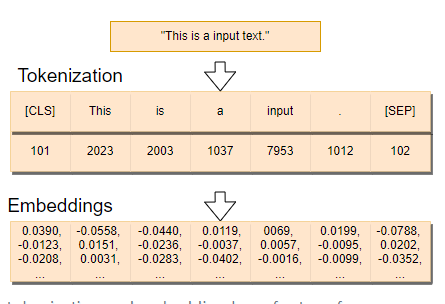
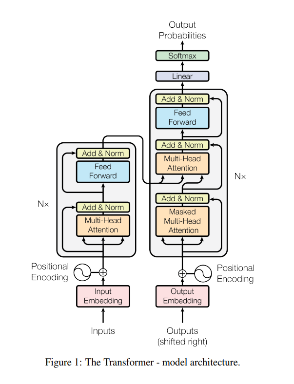
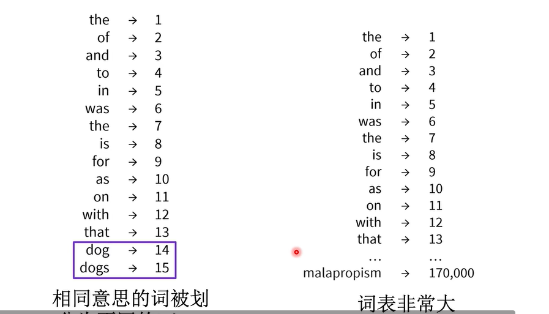
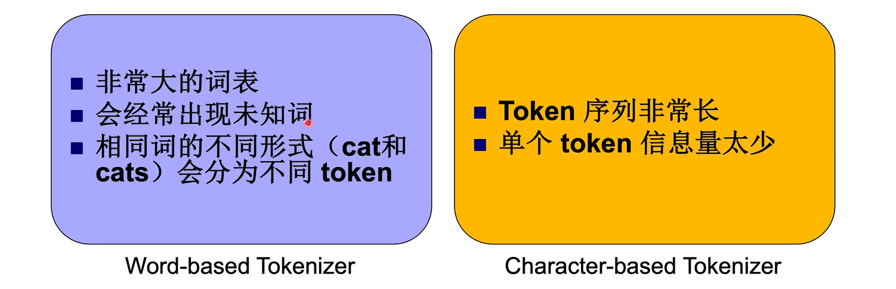
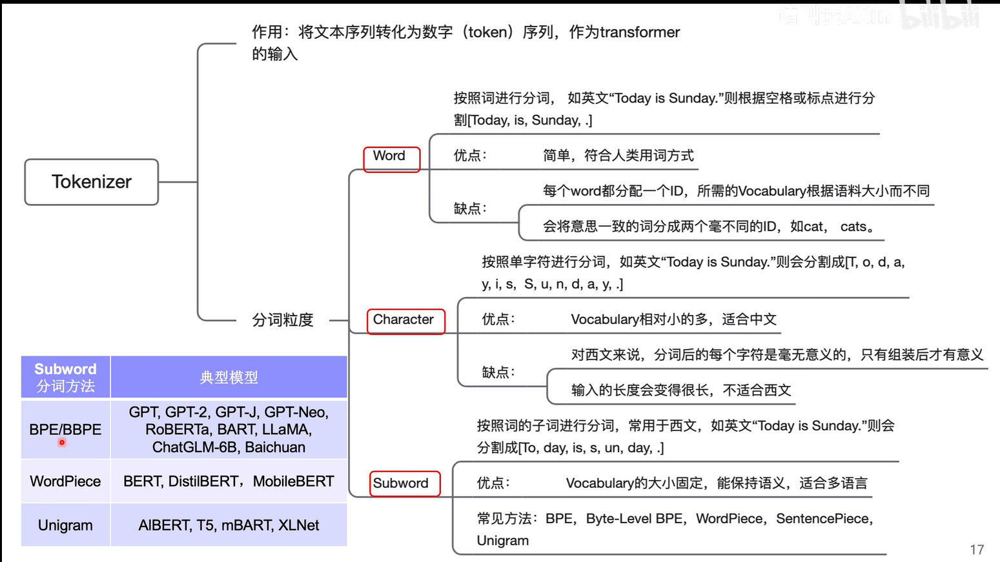

# tokenizer的定义

>tokenizer也叫分词器

作用：

- **文本序列**通过 Tokenizer 被转化为**数字序列**（token 编号/id）。
- 是训练和微调大型语言模型（LLM）必不可少的一部分。  
  
---

---
Tokenizer 在transformer的架构中处于**Embdedding Input**区域，如图（内置） l

# 不同粒度的分词

## Word-based Tokenizers

Word level 分词一般通过空格或者标点符号来把文本分成一个个单词，这样分词之后的 token 数量就不会太多，比如 Today is a good day -> Today, is, a, good, day。但 Word level 分词也有问题，比如英文中的 high, higher, highest 这三个单词显然语义相似，因为另外两个只是比较级，但是 Word level 分词会把他们看成 3 个单独的单词

>优点：符合人的自然语言直觉

>缺点：很多相同意义的词分到一起，词表很大le

 

## Character-based Tokenizers

顾名思义，就是把文本拆分成一个个字符单独表示，比如 highest -> h, i, g, h, e, s, t，一个显然的好处是，Vocab 不会太大，Vocab 的大小为字符集的大小，也不会遇到 Out-of-vocabulary(OOV) 的问题，但是字符本身并没有传达太多的语义，而且分词之后会有太多的 token，光是一个 highest 就可以得到 7 个 token，难以想象很长的文本分出来会有多少个😨

 

## Subword-based Tokenizers
基于词的字词来切分

总结来说，基于Subword该粒度的切分效果是最好的。所以接下来的分词算法都是Subword的变体。
 

*
- BPE         (暂时只讲这个,其他的差不多)
- WordPiece
- SentencePiece
- Unigram LM
